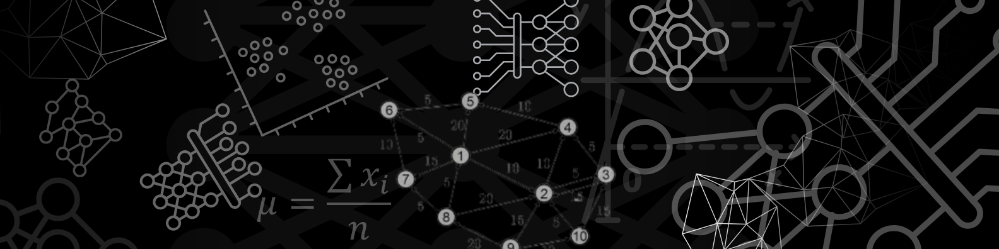



  

  
  
  
  <!-- Logo que representa IA (OpenAI Symbol) -->
  
  

<h2 style="border-bottom: none; padding-bottom: 0;">Sobre mim</h2>

Software Engineer e Estudante de Inteligência Artificial focado em construir sistêmas escaláveis e eurísticos para melhor response, tempo de vida e manutenabilidade. Acredito na potência das automações e no mapeamento de claro de um problema, pois, um algorítimo bem feito na grande maíoria das vezes é um algorítimo bem pensado. Sobre Stacks tenho ótimo conhecimento nas principais do mercado e sou capacitado para me adaptar a qualquer paradigma desconhecido e construir algo a partir somente da documentação.

    <strong>O que eu resolvo?</strong> Problemas.

<!--
**cauaenzo/cauaenzo** is a ✨ _special_ ✨ repository because its `README.md` (this file) appears on your GitHub profile.

Here are some ideas to get you started:

- 🔭 I’m currently working on ...
- 🌱 I’m currently learning ...
- 👯 I’m looking to collaborate on ...
- 🤔 I’m looking for help with ...
- 💬 Ask me about ...
- 📫 How to reach me: ...
- 😄 Pronouns: ...
- ⚡ Fun fact: ...
-->
